This is a tutorial on how to work with a course-specific account for `ieng6.ucsd.edu`. However, I was unable to get my course-specific account (`cs15lfa22az`) to work until very late, so instead the screenshots below will be from my AD account (`fokamoto`). I gave up on getting the course-specific account working in a timely manner after spending literal hours trying and failing, thus reducing my time for other classes and my jobs. I will be following the layout given in the [lab instructions](https://ucsd-cse15l-f22.github.io/week/week1/#week1-lab-report).

1. Installing VScode

    For this tutorial we will be using the terminal in VS Code. Thus, you will need to install it. Go to https://code.visualstudio.com/ and identify the installation for your operating system. Follow the instructions to download and install. Defaults for everything should be enough. When you open it, there should be a screen like this one:

    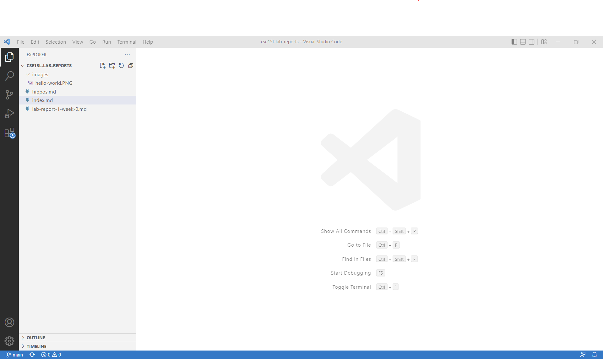

    (My screenshot has a project open on the sidebar, yours will probably look slightly different.)

2. Remotely Connecting

    (Windows users have a sub-step here: install the [Open SHH](https://docs.microsoft.com/en-us/windows-server/administration/openssh/openssh_install_firstuse) **client**)

    Now it's time to use the terminal. First, you have to open it. Open the "Terminal" dropdown from the top bar and select "New Terminal". Alternatively, use a the keyboard shortcut `Ctrl+Shift+`

    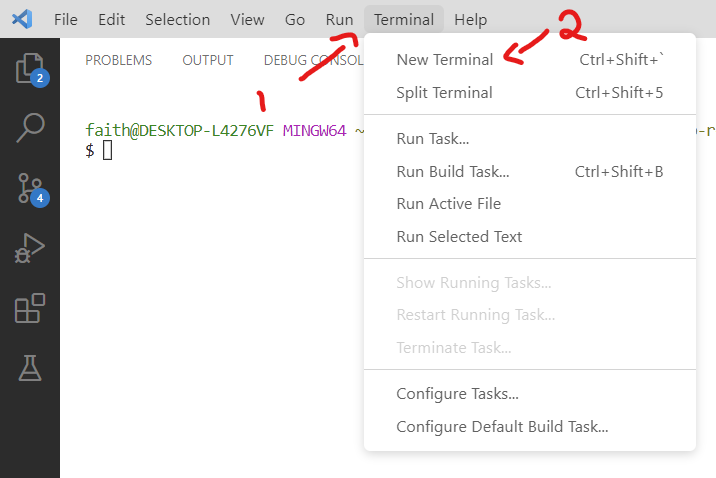

    The terminal commands in this tutorial are meant for bash. If your default terminal opens up as a non-bash shell (here you see my default powershell), then you have to open a new terminal of the correct type. Use the dropdown next to the "+" button, as in the picture.

    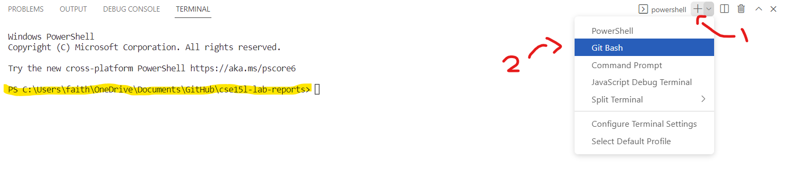

    You should get to a terminal which has a prompt similar to this (compare with the highlighted portion of the previous picture).

    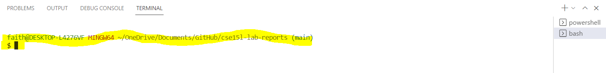

    Now use your course-specific account to log in to the remote computer. "What's my course-specific account?", I imagine you asking. Well, imaginary student reading this, simply go to [this link](https://sdacs.ucsd.edu/~icc/index.php), enter your AD username and student ID, and you should see something like this:

    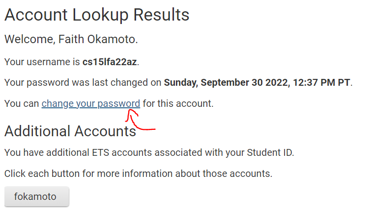

    Change your password following [this tutorial](https://docs.google.com/document/d/1hs7CyQeh-MdUfM9uv99i8tqfneos6Y8bDU0uhn1wqho/edit)

    If the line below "Welcome, <name>" says that your username is your AD username, then make sure to switch to your course-specific account before changing your password. See below for what the account lookup landing at the wrong account looks like:

    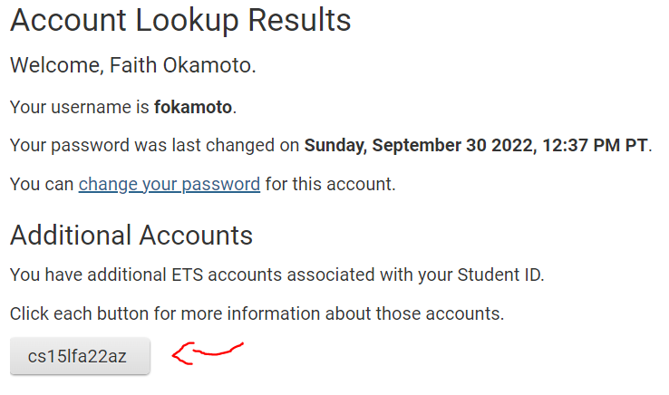

    Okay, now you got a terminal and an account. Time to `ssh`! Use the command `ssh <username>@ieng6.ucsd.edu`, where `<username>` is what the account lookup found. You'll be prompted for a password, and may need to confirm that you want to connect to the sever. This is what it looked like for me (I did not need to confirm because I had connected before):

    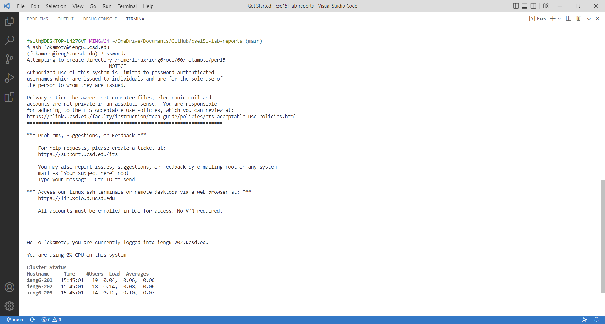

    Congradulations, now you can try running some commands on a remote computer!

3. Trying Some Commands

    There are a few commands which are good to know. I've included some in this screenshot:

    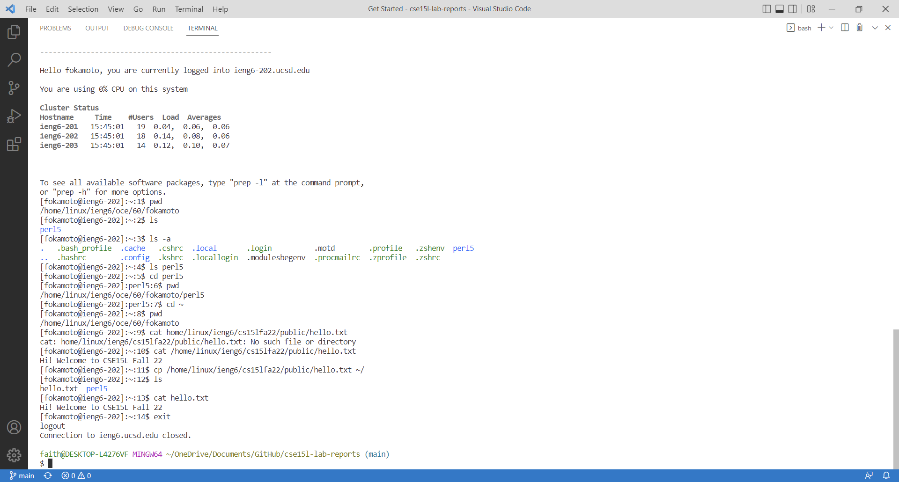

    What's happening here? Glad you asked. A list of the commands run:

    - `pwd` stands for "**p**rint **w**orking **d**irectory". It prints out the path to where I am right now.
    - `ls` **l**i**s**ts all the files present in this location.
    - `ls -a` is our first *flag*. Flags allow you to run a command with certain non-default options active. In this case I'm listing all files *including* hidden files, which start with a `.` character.
    - `ls perl5` lists all the files in the `perl5` directory. (There aren't any, so no output is produced.)
    - `cd perl5` moves the **c**urrent **d**irectory to be `perl5`, which can be confirmed by seeing the output of `pwd`
    - `cd ~` uses a shortcut: the character `~` ("tilde") stands for our "home" directory, or where we were by default at the beginning.
    - `cat <file>` reads the contents of the file at the specified path, then prints out those contents, assuming that the file exists.
    - `cp <old> <new>` **c**o**p**ies the file at the location `<old>` and moves it to `<new>`. We can see this works because `hello.txt` is now listed when running `ls`.
    
    I encourage you to try some of these commands out. Make sure that you at the very least copy the file `hello.txt` into your home directory.

4. Moving Files with `scp`

    So now you know how to copy a file to another location on the same computer. But you can do that without the terminal - what's the point of all this fancy logging into another computer? Well, here's something fun to do: `scp`. That stands for **s**ecure **c**o**p**y, and we can use it to move files across the `ssh` connection!

    First, we need a file to move. Copy this code and put it on your compter as `WhereAmI.java`. It's also on this website at [this link](/code/WhereAmI.java) Ideally, it should be somewhere easily accessible by your shell.

    ```
    class WhereAmI {
        public static void main(String[] args) {
            System.out.println(System.getProperty("os.name"));
            System.out.println(System.getProperty("user.name"));
            System.out.println(System.getProperty("user.home"));
            System.out.println(System.getProperty("user.dir"));
        }
    }
    ```

    See how I did it, then I'll explain each bit so that you can do it for yourself:

    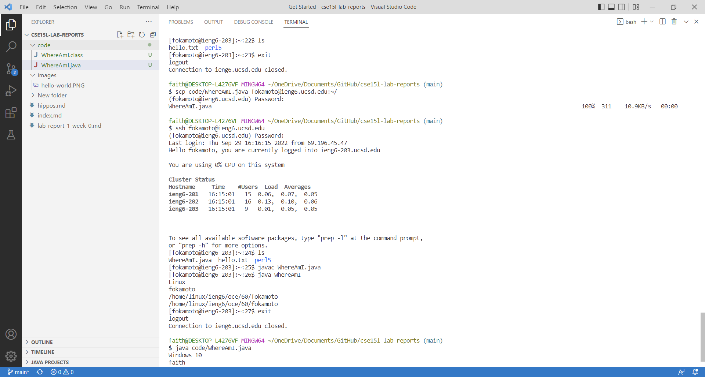

    - At the top is a `ls` to show that `WhereAmI.java` is not present.
    - Then, back on my computer, the key command: `scp <old> <new>`. Note that the remote address is specified first by the address you log into and `:` before the path relative to `~`, the home directory.
    - Logging back in, the file is there, acording to `ls`.
    - Compiling and running the file (`javac` is on the `.java` file, while `java` is on the name of the class, don't forget) prints out the specifications for the remote computer.
    - I went back to my home computer to run the same file. This same program has a different output depending on the computer it's run on, as you can see at the bottom: my computer has different specifications than the remote one.

    You try it now! Use `scp` to move `WhereAmI.java` to the remote computer, then run it on both your home and remote computers to see the difference.

5. Setting an SSH Key

    It's sure annoying to have to type in a password so many times to transfer and check back in, ain't it? Here's a trick to stop having to type the password in. First, you have to create a pair of cryptographic keys. Run `ssh-keygen` on your own computer and hit "enter" for all prompts to use the defaults.

    Take note of the default path for where the keys were created! You'll need that later.

    Now `ssh` into the server and create a directory called `.ssh`. In other words, run this sequence of commands:

    - `ssh <username>@ieng6.ucsd.edu`
    - `mkdir .ssh`
    - `exit`

    Now you can `scp` the `id_rsa.pub` key into `~/.ssh/authorized_keys`. No, I'm not telling you the specific command. Figure it out from the section on `scp` right above this one. You know where the `.pub` file is and you know where you're copying it too, that should be enough :)

    If that was all set up correctly, you should be able to `ssh` in without a password prompt, as I do here:

    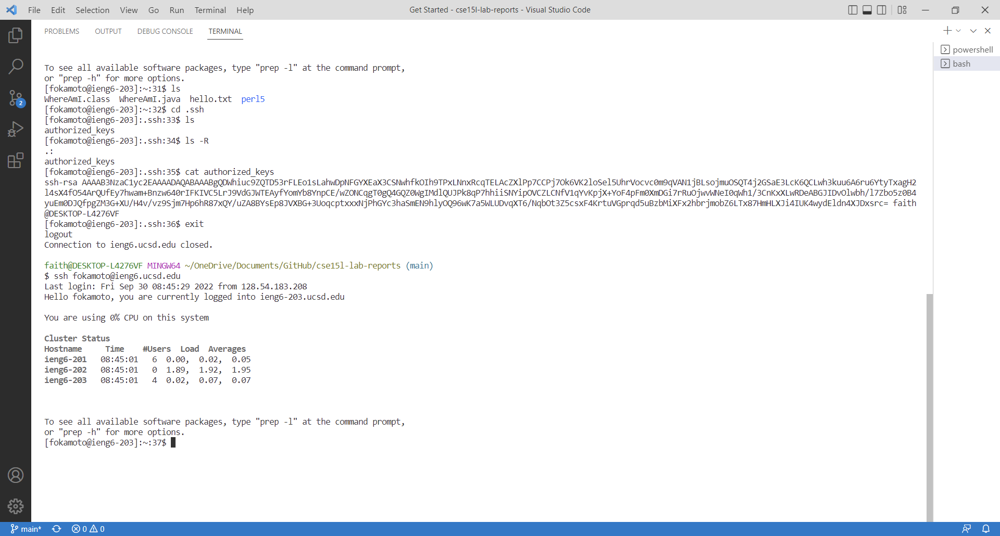

6. Optimizing Remote Running

    There are ways to use keyboard shortcuts to move and run the file even quicker! Once `WhereAmI.java` is edited, I did the transfer in six keystrokes: two repeats of "up arrow, up arrow, enter". This might be slightly cheating because I needed to have the commands prepared and entered above, but if you are doing lots of transfers at the same time that's a reasonable assumption. See below:

    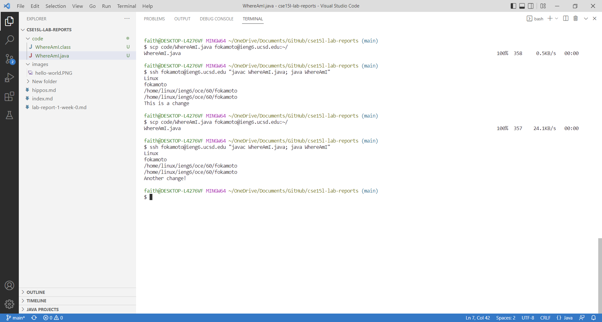

    Note that in between the second and third commands pictured, I edited `WhereAmI.java` outside of the terminal.