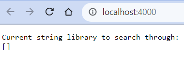
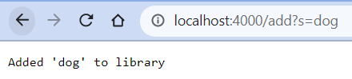
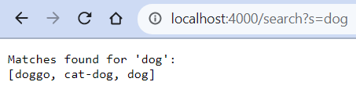

## Part 1

During the Week 2 lab I made a simple little search engine. This was the code:

```
import java.io.IOException;
import java.net.URI;
// used for storing unique strings
import java.util.HashSet;

class Handler implements URLHandler {
    // The one bit of state on the server: a number that will be manipulated by
    // various requests.
    HashSet<String> library = new HashSet<>();

    public String handleRequest(URI url) {
        // default page is the available library
        if (url.getPath().equals("/")) {
            return "Current string library to search through:\n" + library.toString();
        // /add page adds a string to the library
        } else if (url.getPath().equals("/add")) {
            String query = url.getQuery();
            // only accept properly formatted queries
            if (query != null && query.split("=").length == 2 && 
                query.split("=")[0].equals("s")) {
                String word = query.split("=")[1];
                // only add new words if necessary
                if (library.contains(word)) {
                    return "Library already contains '" + word + "'.";
                }
                else {
                    library.add(word);
                    return "Added '" + word + "' to library";
                }
            }
            // warn user that their query was not accepted
            return "To add a word to the library, use a query such as '?s=cat'. Your query: " + query;
        // /search page adds a string to the library
        } else if (url.getPath().equals("/search")) {
            String query = url.getQuery();
            // only accept properly formatted queries
            if (query != null && query.split("=").length == 2 && 
                query.split("=")[0].equals("s")) {
                String search = query.split("=")[1];
                // for storing any string matches found in the library
                HashSet<String> found = new HashSet<>();
                for (String word : library) {
                    if (word.contains(search)) {found.add(word);}
                }
                // pretty-print results
                if (found.isEmpty()) {
                    return "No matches found in library for '" + search + "'.";
                } else {
                    return "Matches found for '" + search + "':\n" + found.toString();
                }
            }
            // warn user that their query was not accepted
            return "To search the library, use a query such as '?s=cat'. Your query: " + query;
        // any other page 404s
        } else {
            return "404 Not Found!";
        }
    }
}

class SearchEngine {
    public static void main(String[] args) throws IOException {
        if(args.length == 0){
            System.out.println("Missing port number! Try any number between 1024 to 49151");
            return;
        }

        int port = Integer.parseInt(args[0]);

        Server.start(port, new Handler());
    }
}
```

That's a lot of code! Let's see it in action, then it should make more sense. Here are some screenshots; I'll explain each as we go.

1. 

    This is the default page. For it to appear, `SearchEngine`'s main method must have executed. As you can see at the bottom of the code, it set up a server via port 4000<sup>1</sup>. The server uses a `Handler` instance to handle URL<sup>2</sup> requests. 
    
    Because I'm on the default page the path is just `/`. Thus the `Handler`'s `handleRequest` method (which is passed the entire URL you see in the browser) will execute the part of the if statement within the first block: `if (url.getPath().equals("/"))`. This prints a standardized statement and then the current library contents. The library is of course empty, because we haven't added anything to it yet! Time to move on to some more fun parts of this server.
2. 

    Look carefully at the top of the page. In this case the **path** is everything from the first `/` up to before the first `?`. Thus, the `handleRequest` method receives `/path` as the URL; the block within `else if (url.getPath().equals("/add"))` will be executed.

    What does this page do? Well, first it gets the **query**. That's a new word! Basically, it's the bit after the `?`. The `handleURL` does some input-structure checking with `if (query != null && query.split("=").length == 2 && query.split("=")[0].equals("s"))`. Let me explain how that works!
    - First, let's check if there is a query. The add page expects one, so if this fails there's no point in checking further.
    - Second, let's check if there is exactly one part to the query; when it's split at its `=` we expect what was originally `?X=Y` to have exactly two parts.
    - Third, that first part - the `X` - should be "s" exactly, because that's the query we expect.

    Note that the query used here passes all these tests, but if any failed then an error message would be printed with information about what the problem was.

    Now that the query has been accepted as properly formatted, the word we tried to add is extracted and added to the library. There is some checking as to whether adding is necessary<sup>3</sup>. Depending on that, a message is printed acknowledging the word queried and informing the user as to what happened. We got a nice success message. At this point `library` contains the string "dog" and nothing else.
3. 

    I know I just said that the library only had one string, but for the purposes of this example being more interesting I added a few more in<sup>4</sup>. On this page the path is `/search`, so we're going to that block in `handleURL`, and the query is the same as before.

    The search page checks for valid queries exactly how the add page does. But what it does with the validated words is different, as you can see. It acknowledges the word which was search for and then prints out all the matches found in the library. Matches are found by a for-each loop through `library`. Each word is checked with a `.contains()` invocation. This ensures that the substring queried for may appear anywhere within the word. You can see how the query finds "dog" in varied places within the words.

    There would be a different message printed if nothing was found matching the query string, but fortunately this library is sufficiently dog-filled! Note that no matter what this block will not modify `library`, so it's the same as before.

<sup>1</sup> I passed 4000 to the command line, it has no significance.  
<sup>2</sup> That stands for **U**niform **R**esource **L**ocator.  
<sup>3</sup> The underlying implementation here is a `HashSet`, so adding new elements exactly equal to ones before wouldn't do anything.  
<sup>4</sup> In particular, I added "doggo", "cat-dog", and "cat" using the same add page but with different queries. The exact queries used are left as an exercise for the reader: look at what was used to add "dog" and extend the idea.

## Part 2

Now we will move on to what I did during Week 3's lab. I'll examine bugs found in two files.

1. This first is from the `ListExamples` file, specifically its `filter` method.
    - **Failure-inducing input:**
    ```
    @Test
    public void testFilter() {
        List<String> input = new ArrayList<>(Arrays.asList("dog1", "dog2"));
        StringChecker checker = new DogChecker();
        assertEquals(new ArrayList<>(Arrays.asList("dog1", "dog2")),
                        ListExamples.filter(input, checker));
    }
    ```
    Let's look at what this is doing. The first line, `@Test`, is just to tell the compiler that `testFilter` is a unit test and should be executed when running tests. Inside the test we create some inputs to give to the function. The first, `input`, will be an `ArrayList` which has two values: "dog1" and "dog2", in that order. The second, `checker`, will be a `DogChecker`, which is just a silly little `StringChecker` which checks whether `String`s start with "dog"<sup>1</sup>. Then we do the actual test... but I'll get to that in the next section.
    - **Symptom:** The `filter` method should remove any `String`s from the input `List` which fail the test laid out by the input `StringChecker`, but leave all the others in the correct order. Since both of the `String`s in the input start with "dog", they should be returned just as they are. But alas alack! Instead, they were returned in reverse order. What?

    ```
    >> java -cp ".;lib/junit-4.13.2.jar;lib/hamcrest-core-1.3.jar" org.junit.runner.JUnitCore ListTests
    JUnit version 4.13.2
    ..E
    Time: 0.006
    There was 1 failure:
    1) testFilter(ListTests)
    java.lang.AssertionError: expected:<[dog1, dog2]> but was:<[dog2, dog1]>
            at org.junit.Assert.fail(Assert.java:89)
            at org.junit.Assert.failNotEquals(Assert.java:835)
            at org.junit.Assert.assertEquals(Assert.java:120)
            at org.junit.Assert.assertEquals(Assert.java:146)
            at ListTests.testFilter(ListTests.java:19)

    FAILURES!!!
    Tests run: 2,  Failures: 1
    ```
    
    - **Bug:** The line adding `String`s to the filtered list had to be changed from `.add(0, s)`<sup>2</sup> to `.add(s)`. In other words, this block (which checks if the current string passes and adds it to the return value if so), was previously:
    ```
    if(sc.checkString(s)) {
        result.add(0, s);
    }
    ```
    but should have been:
    ```
    if(sc.checkString(s)) {
        result.add(s);
    }
    ```
    - **Why that fixed the problem:** The `String`s in the input list were being looked at from first to last, as one would expect. However, they were all being added to the *front* of the filtered list. This meant that each pushed all the others back, so those encountered first would be at the back of the finished filtered list. Which of course reversed the final result! The fix was to append instead of prepend, which is what the index-less `add` method will do.
2. This second is from the `FileExample` file, specifically its `getFiles` method.
    - **Failure-inducing input:**
    ```
    @Test 
	public void testGetFilesDir() {
        try {
        assertEquals(new ArrayList<File>(Arrays.asList(
            new File("some-files/more-files/b.txt"), 
            new File("some-files/more-files/c.java"))
            ), FileExample.getFiles(new File("some-files/more-files")));
        } catch (IOException e) {
            fail("IOException thrown when there shouldn't be one");
        }
	}
    ```
    Inside this test there's a try-catch statement. That's necessary because the method we're testing declares that it might throw and `IOException`. We don't expect to do that, though, since we're passing a legal path. As an input we give the directory `some-files/more-files`. It contains two files: `b.txt` and `c.java`.
    - **Symptom:** The `getFiles` method, in the case that it's passed a directory, should return an ArrayList of all the files within it. In this case that should be `b.txt` and `c.java`, but as fancy `File` objects, so that's the cause of such ado around constructing the `ArrayList` to compare against. However, more than that was returned: the output includes the very directory we passed. But that's not a file!

    ```
    >> java -cp ".;lib/junit-4.13.2.jar;lib/hamcrest-core-1.3.jar" org.junit.runner.JUnitCore FileTests
    JUnit version 4.13.2
    .E.E
    Time: 0.008
    There were 2 failures:
    1) [test for a different problem]
    2) testGetFilesDir(FileTests)
    java.lang.AssertionError: expected:<[some-files\more-files\b.txt, some-files\more-files\c.java]> but was:<[some-files\more-files, some-files\more-files\b.txt, 
    some-files\more-files\c.java]>
            at org.junit.Assert.fail(Assert.java:89)
            at org.junit.Assert.failNotEquals(Assert.java:835)
            at org.junit.Assert.assertEquals(Assert.java:120)
            at org.junit.Assert.assertEquals(Assert.java:146)
            at FileTests.testGetFilesDir(FileTests.java:11)

    FAILURES!!!
    Tests run: 2,  Failures: 2
    ```
    
    - **Bug:** The line which adds the starting location to the output had to be wrapped in an if statement checking whether it was a directory or not, to prevent incorrect additions. So, the code which started as this:
    ```
    File f = start;
    List<File> result = new ArrayList<>();
	result.add(start);
	if(f.isDirectory()) {
        # handle case where f is a directory
    }
    ```
    should instead be this:
    ```
    File f = start;
    List<File> result = new ArrayList<>();
	if(f.isFile()) result.add(start);
	else if(f.isDirectory()) {
        # handle case where f is a directory
    }
    ```
    - **Why that fixed the problem:** The `File` passed to `getFiles` was being blindly added to the output, even though the specification said that only actual files should be included, sans any directory. By checking whether the input was a directory, and neglecting to include it in the output if so, the errant output escapes, leaving behind only what is proper.<sup>3</sup>

<sup>1</sup> Those still paying attention, after I made Part 1 objectively too long, may be noting a theme in the strings I use for testing :)  
<sup>2</sup> Here `s` is a variable containing the current string. Hey, not a naming convention I chose.  
<sup>3</sup> Look, it's past 8:30PM, I want to stop doing this, and historically that has meant that the words coming out of my fingers are of... questionable linguistic level for the task at hand.