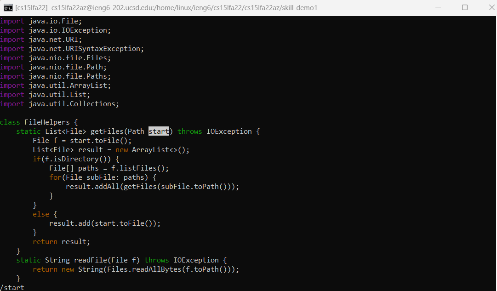
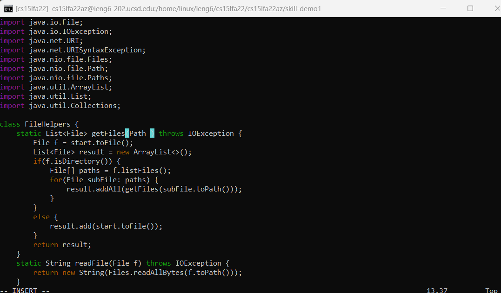
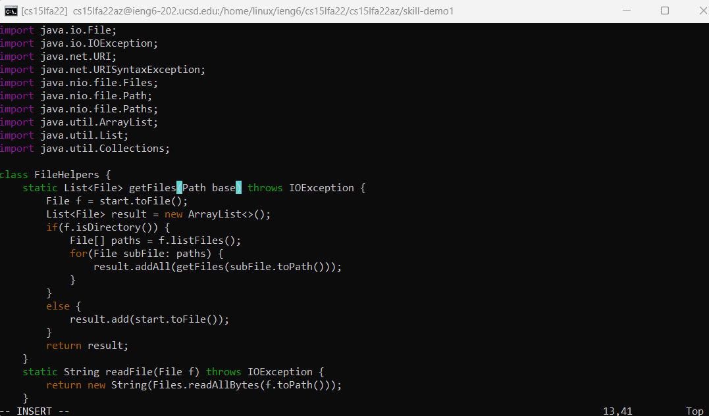
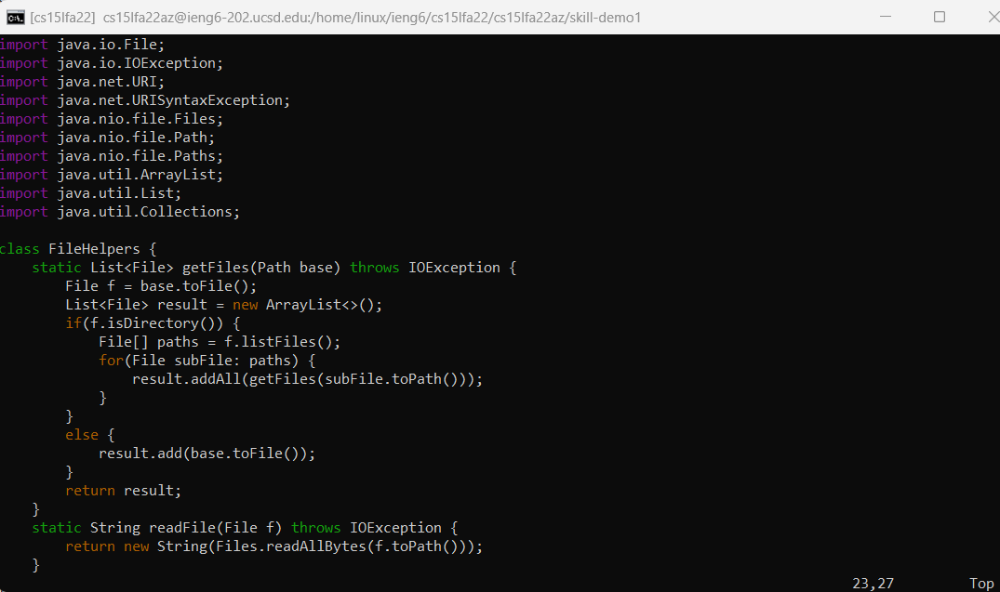
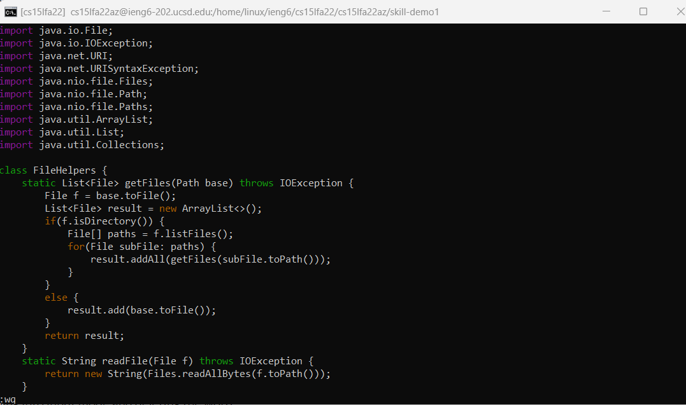

## Part 1

For this lab we'll (i.e. I'll) be editing a file with `vim`, a powerful text editor with far more bells and whistles than buttons. Such a feat is easily achieved by having no buttons. That's right, this is a *command-line* text editor. The only input 'round these parts is keyboard input!

Specifically, I'll be editing the file [`DocSearchServer.java`](https://github.com/ucsd-cse15l-f22/skill-demo1/blob/main/DocSearchServer.java) from [this repository](https://github.com/ucsd-cse15l-f22/skill-demo1). The specific bit of interest is here:

```
static List<File> getFiles(Path start) throws IOException {
    File f = start.toFile();
    List<File> result = new ArrayList<>();
    if(f.isDirectory()) {
        File[] paths = f.listFiles();
        for(File subFile: paths) {
            result.addAll(getFiles(subFile.toPath()));
        }
    }
    else {
        result.add(start.toFile());
    }
    return result;
}
```

We want to replace all instances of `start` with `base`. After launching the text editor with `vim DocSearchServer.java` (which automatically places the cursor at the top of the file), the first thing to do is... find an instance of `start` to replace. To search from `vim`'s "normal" mode, which is what you're in by default, the syntax is `/<search-term>`. Thus, I've typed `/start` in this progress picture. Notice how the first instance of it, moving from the top down, has been highlighted; that happened because I hit `<Enter>` to execute the search. The characters I've typed within normal mode can be seen in the bottom-left corner of the screen.



Now, let's get rid of this word we dislike. It would also be nice to get out of this "normal" mode, because we can't actually type text in here! "But *normal* text editors let you just type text!" I here a `vim` novice groaning in the back of my head. Well, yes, but in this editor to do the standard keyboard entry of text into a document, you need to be in "insert" mode. Luckily, there's a way to go from normal mode to insert mode while also deleting this pesky word we need to replace. That way is `ce`, which has two parts:

- `c`: change (this will enter insert mode after performing a "motion")
- `e`: end of word (this is the motion which `c` performs: it removes the current word until the end so that we can change it)

After typing `ce` we get to here. Note that the bottom-left corner now says "INSERT" to indicate what mode we're in.



This next bit is expected: type `base` and that text inserts itself where the cursor is, i.e. where "start" used to be.



We're done with that normal text editor stuff for now. It's time for some `vim` magic. After getting back into normal mode (to run commands without insert mode trying to type them into the document) by using `<Esc>`, we hit `n.n.` - that's the `n` key, followed by a period, and then those repeated again. The `n` simply moves to the next search result, since we need to get there to edit it. Then pressing `.` will repeat the last edit. Since the last edit was replacing `start` with `base` with a cursor at the start of the word, that's what happens. Twice! So simple to repeat a find-and-replace. Note that, according to the bottom left, we're no longer in insert mode. All of those edits were performed with normal mode commands.



Finally, since we've finished editing this document, it's time to save and exit. Luckily we're already in normal mode. The command is a simple `:wq<Enter>` - again, note how `<Enter>` tells the editor that we've finished typing out a command and would now like to submit it. For clarity's sake, I'll explain each part of the command:

- `w`: write (save the current state of the file)
- `q`: quit (exit the editor)

Here's what it looked like before I hit `<Enter>`. See how the bottom shows the in-progress command I typed in normal mode. 



For those who've been keeping track, this entire sequence was `/start<Enter>cebase<Esc>n.n.:wq<Enter>`: only twenty-two keypresses in total, no mouse required. I told you it was powerful.

## Part 2

For this part I experimented with performing the exact same edit (specifically, the one I just demonstrated: replacing `start` with `base` within the `FileHelpers.getFiles` method) on VS Code and on the remote server. When using the local text editor I of course had to `scp` the file over for the change to take effect. Due to all the finicky navigation, it took me over twice as long as doing it all via `vim`: 39s vs. 19s. Everything went swimmingly, as the times would suggest. I see there are some discussion questions the lovely IAs would like me to answer, so I'll do that now.

1. If I had to work on a program which was being run remotely, I would (and have!) preferred using `vim` over editing locally. Especially for small, incremental edits, as usually happens when debugging, it's too much of a hassel to transfer files and navigate between computers/files every time. I wasnt comfortable doing too much magic but then that wasn't needed to try deleting single characters or tweaking a few lines to see the result.
2. As mentioned above, some things that would affect my decision are the size of the edits and whether I needed to do anything fancy during them. Simple edits, even if I perhaps have to look up the vim shortcuts, might be easier to do on the remote just to avoid `scp`. But a larger, complicated edit would benefit from the familiarity of VS Code.