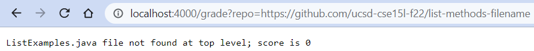
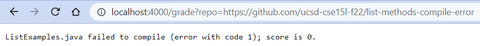

Have some context before I throw a giant code block at you. (I suppose that would be appreciated.) This is an autograder: it takes a reposity with some code, grades it based on certain criteria, then reports back what grade the code received. For `grade.sh`, as one might suspect from the extension, this is contained within a shell script. The reposity will be the first command-line argument (accessible via `$1`), and the grade will be printed to standard output. Enough dilly-dallying, time to see the code.

```
# make script quit if it has an error - mostly for debugging purposes
set -e

# set up directory with student submission
rm -rf student-submission
git clone --quiet $1 student-submission
cp TestListExamples.java student-submission
cd student-submission

# check if the ListExamples.java file matches the given specifications
if [[ ! -f ListExamples.java ]]
then
    echo "ListExamples.java file not found at top level; score is 0"
    exit 0
fi
if [[ $(grep -c "interface StringChecker { boolean checkString(String s); }" ListExamples.java) -eq 0 ]]
then
    echo "ListExamples.java does not have the correct StringChecker interface; score is 0"
    exit 0
fi
if [[ $(grep -Ec 'static List<String> filter\(List<String>.+, StringChecker.+\)' ListExamples.java) -eq 0 ]]
then
    echo "ListExamples.java does not have a filter method with the expected signature; score is 0"
    exit 0
fi
if [[ $(grep -Ec 'static List<String> merge\(List<String>.+, List<String>.+\)' ListExamples.java) == 0 ]]
then
    echo "ListExamples.java does not have a merge method with the expected signature; score is 0"
    exit 0
fi

# attempt compilation of ListExamples.java (unset -e because this might error)
set +e
# redirect error output so it doesn't print
javac ListExamples.java 2> error.txt
EXIT=$?
set -e

# make sure the ListExamples class compiled
if [[ $EXIT -ne 0 ]]
then
    echo "ListExamples.java failed to compile (error with code $EXIT); score is 0."
    exit 0
fi
if [[ ! -f ListExamples.class ]]
then
    echo "ListExamples class not found; score is 0"
    exit 0
fi

# compile tester
CP=".;../lib/hamcrest-core-1.3.jar;../lib/junit-4.13.2.jar" 
javac -cp $CP TestListExamples.java
# run tester (unset -e because this might error)
set +e
java -cp $CP org.junit.runner.JUnitCore TestListExamples > test.txt
set -e

# detect number of passed tests; report score
if [[ $(grep -c "^OK" test.txt) -eq 1 ]]
then
    TESTS=$(grep -Po "\d+ test" test.txt | grep -Po "\d+")
    echo "All tests passed; score is ${TESTS}"
else
    TESTS=$(grep -Po "Tests run: \d+" test.txt | grep -Po "\d+")
    FAILED=$(grep -Po "Failures: \d+" test.txt | grep -Po "\d+")
    PASSED=$((TESTS - FAILED))
    echo "${PASSED} out of ${TESTS} tests passed; score is ${PASSED}."
fi
```

Now you've seen the code. Let's watch it in action. Using [`GradeServer.java`](https://github.com/Faith-Okamoto/list-examples-grader/blob/main/GradeServer.java) this script can be set up to run via the broswer. That Java-based server will accept URL requests in the form of `https://localhost:4000/grade?repo=X`, then pass `X` to `grade.sh`, and finally take the output of the script for display in the browser. I'll show three examples.

1. 
    - Repository: https://github.com/ucsd-cse15l-f22/list-methods-filename
    - Grade: 0

    This is a pretty early failure. Part of the specification was that a file called `ListExamples.java` had to be submitted. What happened here is the script cloned the given repo, `cd`'ed inside of it, and then promptly failed to find the file it was supposed to grade. No file to grade, no points to give! Now, there is a fine implmentation of the rest of the specification, but because it isn't within a file named as expected, the grader isn't going to bother to guess exactly how the student went wrong.
2. 
    - Repository: https://github.com/ucsd-cse15l-f22/list-methods-compile-error
    - Grade: 0

    Here the script has managed to get a bit further along. It found `ListExamples.java`, then gamely attempted compilation (a necessary step before running the tester), but that step didn't work. Instead of erroring itself, `grade.sh` noticed the error, decided that if the code don't compile than they don't get no points, and exited with a message explaining that. See a deeper explanation below.
3. 
    - Repository: https://github.com/ucsd-cse15l-f22/list-examples-subtle
    - Grade: 12

    So close! The `ListExamples.java` file was found, compiled, the tester was run, and it gave back... that something went wrong. Note that the output is a digested version of what JUnit returns. No details are provided about which tests failed, nor are any contextual bits (e.g. the line with `.` to show when each test started) included. Instead this is bare-bones. The tests ran, not all passed, here's your score.

Time to explain what is happening! You've seen the script, you've seen some examples (so you know what the idea of the script is), now let's trace one of these. Specifically, I'll explain how grading https://github.com/ucsd-cse15l-f22/list-methods-compile-error works. The problem with the `ListExamples.java` file therein is a missing semicolon, causing a catastrophic compilation error. What's a poor autograder to do? Let's walk through bit by bit.

- ```
  # make script quit if it has an error - mostly for debugging purposes
  set -e
  ```
    As the comment suggests, this overrides the default behavior of bash scripting and will cause `grade.sh` to immediatly exit upon any errors. It shouldn't do that - all lines which might error have this setting turned back to `set +e` - but best to be safe, especially when I was developing this script and needed quick, understandable debugging feedback.
- ```
  # set up directory with student submission
  rm -rf student-submission
  git clone --quiet $1 student-submission
  cp TestListExamples.java student-submission
  cd student-submission
  ```
    These commands all went off without a hitch (exit codes of `0` 'round the table), but then, given that the repo link works, they were always going to. They, from first to last, get rid of any currently-existing `student-submission` directory (so the name becomes available), clone the given repository into a new `student-submission` directory, copy the tester file into that directory, and finally move into the new directory (as that's now where all the files are). Nothing produces either standard error or standard output.
    
    Of particular note is the `git clone` line. Its `--quiet` option supresses *all* output, whether standard output such as `Cloning into 'student-submission'...`, or standard error. This is done since the grader is trying to run under the hood. It manages to exit with code `0` because the repository it's passed actually exists.
- Now we get to a succession of `if` statements! This section basically checks to see whether some surface-level specifications were met. Our intrepid submission passes them all, but let's see why.
    - ```
      if [[ ! -f ListExamples.java ]]
      then
          echo "ListExamples.java file not found at top level; score is 0"
          exit 0
      fi
      ```
        This `if` statement checks if there is a file (`-f`) called `ListExamples.java` in the current working directory. For our submission, this is true, so `! -f ListExamples.java` evaluates to false, skipping the `then` block. Note that we saw this `then` block in action before: when the file was named incorrectly! But it is named correctly now. The final `fi` is just to close the `if` statement. No output/error will be produced; exit code `0`.
    - ```
      if [[ $(grep -c "interface StringChecker { boolean checkString(String s); }" ListExamples.java) -eq 0 ]]
      then
          echo "ListExamples.java does not have the correct StringChecker interface; score is 0"
          exit 0
      fi
      ```
        This `if` statement checks if the literal string "`interface StringChecker { boolean checkString(String s); }`" is present within `ListExamples.java`. If it's not, then the interface may have been defined differently, which will pose problems for the tester's expectations. However, the interface definition is found untouched within our submission. Therefore `grep -c` will count exactly one result, and that will fail to `-eq 0`, so the grader moves on, skipping the `then` block. No output/error will be produced; exit code `0`.
    - ```
      if [[ $(grep -Ec 'static List<String> filter\(List<String>.+, StringChecker.+\)' ListExamples.java) -eq 0 ]]
      then
          echo "ListExamples.java does not have a filter method with the expected signature; score is 0"
          exit 0
      fi
      ```
        This `if` statement check is a method matching the specified `filter` signature is present within `ListExamples.java`. A regex is used (`-E`) in order to be flexible about what the arguments are named. (Using regex is the reason why parentheses have to be escaped.) Our submission does indeed contain the needed signature. Therefore `grep -c` will count exactly one result, and that will fail to `-eq 0`, so the grader moves on, skipping the `then` block. No output/error will be produced; exit code `0`.
    - ```
      if [[ $(grep -Ec 'static List<String> merge\(List<String>.+, List<String>.+\)' ListExamples.java) == 0 ]]
      then
          echo "ListExamples.java does not have a merge method with the expected signature; score is 0"
          exit 0
      fi
      ```
        Same as before, except now we're checking for a proper `merge` signature. Our submission does indeed contain the needed signature. Therefore `grep -c` will count exactly one result, and that will fail to `-eq 0`, so the grader moves on, skipping the `then` block. No output/error will be produced; exit code `0`.
- ```
  # attempt compilation of ListExamples.java (unset -e because this might error)
  set +e
  # redirect error output so it doesn't print
  javac ListExamples.java 2> error.txt
  EXIT=$?
  set -e
  ```
    As teased before, we've reached a command which has a real and expected possibility of producing an error. The script at this point has no idea what lies within `ListExamples.java`, except that all the signatures seem to be in order. *Anything* could happen when it's compiled with `javac`. For this reason, the script is set to not immediately stop on an error (`set +e`), any potential error output is redirected into a file, and the exit code of the `javac` command is saved into a variable.

    And error it did! Since our repository's `ListExamples.java` file has a compiliation error, the `javac` command will produce some standard error, dutifally stored in `error.txt` to avoid cluttering up the console. The exit code, as you've seen before, is `1`: nonzero! If `set -e` were active the script would stop here, before we could explain the grade. No standard output is produced, however. (And remember, the standard error which was made wasn't output to the user.) Once this dangerous section is done with, `set -e` is turned back on. The grader forges onwards.
- ```
  # make sure the ListExamples class compiled
  if [[ $EXIT -ne 0 ]]
  then
      echo "ListExamples.java failed to compile (error with code $EXIT); score is 0."
      exit 0
  fi
  ```
    Remember, the exit code of the `javac` command is stored in `$EXIT`. It's `1` for our example. Thus, the statement `$EXIT -ne 0` evaluates to true (`1` indeed fails to equal `0`), and now we're in the `then` block. Here at last we get some standard output, from the `echo` command, which will report the compilation failure and its associated score. No standard error, even though there was an error: it's been gracefully caught. The program finishes by exiting with a `0` code. From this entire run, the only standard output produced was from that last `echo` statement, and the only standard error produced is hidden inside a file.

None of the rest of the code (starting with the `fi` of the last code block) will run, since the script had a premature exit. In addition, all the `then` blocks before the last discussed weren't run. Below is `grade.sh` again. Lines which were run have a `+` at the start, while lines which weren't run have a `-`. Comments and whitespace I ignored for annotation purposes

```
# make script quit if it has an error - mostly for debugging purposes
+ set -e

# set up directory with student submission
+ rm -rf student-submission
+ git clone --quiet $1 student-submission
+ cp TestListExamples.java student-submission
+ cd student-submission

# check if the ListExamples.java file matches the given specifications
+ if [[ ! -f ListExamples.java ]]
- then
-     echo "ListExamples.java file not found at top level; score is 0"
-     exit 0
+ fi
+ if [[ $(grep -c "interface StringChecker { boolean checkString(String s); }" ListExamples.java) -eq 0 ]]
- then
-     echo "ListExamples.java does not have the correct StringChecker interface; score is 0"
-     exit 0
+ fi
+ if [[ $(grep -Ec 'static List<String> filter\(List<String>.+, StringChecker.+\)' ListExamples.java) -eq 0 ]]
- then
-     echo "ListExamples.java does not have a filter method with the expected signature; score is 0"
-     exit 0
+ fi
+ if [[ $(grep -Ec 'static List<String> merge\(List<String>.+, List<String>.+\)' ListExamples.java) == 0 ]]
- then
-     echo "ListExamples.java does not have a merge method with the expected signature; score is 0"
-     exit 0
+ fi

# attempt compilation of ListExamples.java (unset -e because this might error)
+ set +e
# redirect error output so it doesn't print
+ javac ListExamples.java 2> error.txt
+ EXIT=$?
+ set -e

# make sure the ListExamples class compiled
+ if [[ $EXIT -ne 0 ]]
+ then
+     echo "ListExamples.java failed to compile (error with code $EXIT); score is 0."
+     exit 0
- fi
- if [[ ! -f ListExamples.class ]]
- then
-     echo "ListExamples class not found; score is 0"
-     exit 0
- fi

# compile tester
- CP=".;../lib/hamcrest-core-1.3.jar;../lib/junit-4.13.2.jar" 
- javac -cp $CP TestListExamples.java
# run tester (unset -e because this might error)
- set +e
- java -cp $CP org.junit.runner.JUnitCore TestListExamples > test.txt
- set -e

# detect number of passed tests; report score
- if [[ $(grep -c "^OK" test.txt) -eq 1 ]]
- then
-     TESTS=$(grep -Po "\d+ test" test.txt | grep -Po "\d+")
-     echo "All tests passed; score is ${TESTS}"
- else
-     TESTS=$(grep -Po "Tests run: \d+" test.txt | grep -Po "\d+")
-     FAILED=$(grep -Po "Failures: \d+" test.txt | grep -Po "\d+")
-     PASSED=$((TESTS - FAILED))
-     echo "${PASSED} out of ${TESTS} tests passed; score is ${PASSED}."
- fi
```